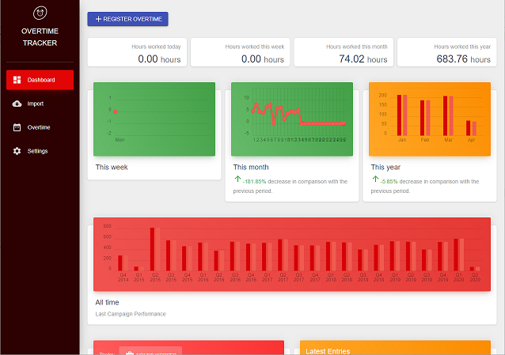
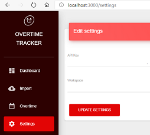

# Toggl Overtime Tracker

The Toggl Overtime Tracker is a simple management application which enables you to manage your overtime using the time registrations you've made in Toggl.

## Installation

Use yarn to install the required packages to run the overtime tracker:

`yarn install`

## Usage

To run the application locally, execute `yarn start`.

Two pieces of information are required:

- Toggl API key
- Workspace ID

To retrieve the Toggl, go to the app and navigate to the profile settings. Near the bottom of the page, you'll find an API token section. Copy the value and paste it 

The workspace is the container that holds projects, time entries, clients, etc. To import the data from Toggl API, we need the workspace as well.

If you navigate to one of the sections mentioned above, you'll find the workspace id in the path: `https://toggl.com/app/projects/{{WORKSPACE_ID}}/list`.

## Deployment

To deploy the web application, run `yarn build`.

To run the application as a Windows application (Electron), run `yarn package-win`. After the script has completed, a MSI file `Toggl Overtime Tracker {MAJOR_VERSION}.{MINOR VERSION}.{REVISION}.msi` will be available under the dist folder.

## Contributing

Pull requests are welcome. For major changes, please open an issue first to discuss what you would like to change.

Please make sure to update tests as appropriate.

## License

[MIT](https://choosealicense.com/licenses/mit/)